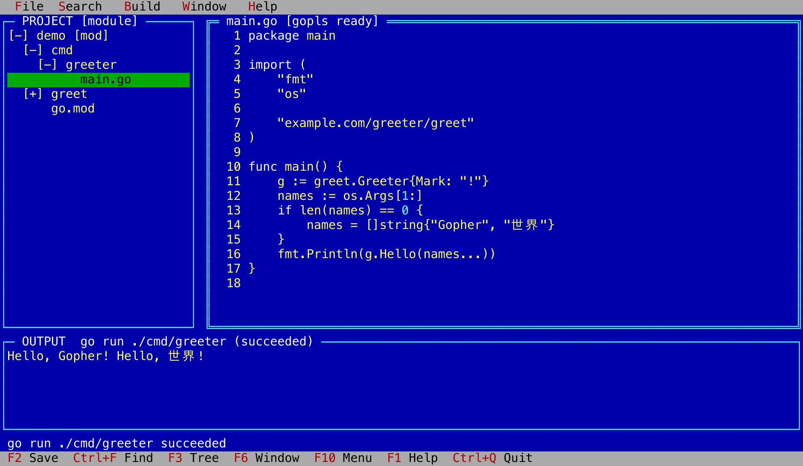

# RapidGo

RapidGo is a lightweight, keyboard-first terminal IDE for Go. Linux, macOS, and Windows are the intended runtime platforms; BSD and other server Unix systems are best-effort targets. Android and iOS are not runtime targets, though they can be SSH clients to a machine running RapidGo. A typical remote workflow is:

```sh
ssh devbox
cd project
rapidgo .
```

The interface draws on the classic Borland DOS IDEs: Turbo Pascal's discoverable, keyboard-first visual style and Borland C++'s Project window. The project tree is not a Turbo Pascal 7 feature; TP7 managed projects through a primary file and project-specific configuration. RapidGo brings browsing, conventional non-modal editing, and build diagnostics together in one terminal application. It is intentionally not a Vim or Neovim configuration.



## MVP

Version 0.1 covers this complete loop without leaving the terminal:

> browse → edit → save/format → build/test → inspect diagnostic → jump to source → fix → run

The MVP includes:

- Project and file tree
- Built-in non-modal UTF-8 editor with Go syntax highlighting
- File open/save, in-file search, and format-on-save with `gofmt`
- Asynchronous `go build ./...`, `go test -json ./...`, and `go run` on a resolved main package
- Integrated output and a shared diagnostic model
- Selection of `file:line:column` diagnostics and source navigation
- Discoverable keyboard shortcuts and function keys
- First-class SSH, tmux, terminal resize, and UTF-8 behavior

See the complete [MVP scope and acceptance test](docs/MVP.md) and [architecture](docs/ARCHITECTURE.md).

## Screenshots

gopls problems appear in the gutter and in the Errors view; Enter jumps to the source.

```text
  File  Search   Build   Window   Help
┌─ PROJECT [module] ─┐ ┌─ main.go [gopls 1 error, 0 warning] ────────────────────────────┐
│[-] demo [mod]      │ │   5     "os"                                                    │
│  [-] cmd           │ │   6                                                             │
│    [-] greeter     │ │   7     "example.com/greeter/greet"                             │
│          main.go   │ │   8 )                                                           │
│  [+] greet         │ │   9                                                             │
│      go.mod        │ │  10 func main() {                                               │
│                    │ │  11     g := greet.Greeter{Mark: "!"}                           │
│                    │ │  12     names := os.Args[1:]                                    │
│                    │ │  13     if len(names) == 0 {                                    │
│                    │ │  14         names = []string{"Gopher", "World"}                 │
│                    │ │  15     }                                                       │
│                    │ │  16!    fmt.Println(g.Helo(names...))                           │
└────────────────────┘ └─────────────────────────────────────────────────────────────────┘
╔═ ERRORS  1 diagnostic(s) ══════════════════════════════════════════════════════════════╗
║cmd/greeter/main.go:16:16 [error] g.Helo undefined (type greet.Greeter has no field or m║
║                                                                                        ║
║                                                                                        ║
║                                                                                        ║
║                                                                                        ║
║                                                                                        ║
║                                                                                        ║
║                                                                                        ║
║                                                                                        ║
║                                                                                        ║
║                                                                                        ║
╚════════════════════════════════════════════════════════════════════════════════════════╝
 gopls 16:16: g.Helo undefined (type greet.Greeter has no field or method Helo)
 F2 Save  Ctrl+F Find  F3 Tree  F6 Window  F10 Menu  F1 Help  Ctrl+Q Quit
```

`Alt+I` shows gopls hover information for the symbol under the caret.

```text
  File  Search   Build   Window   Help
┌─ PROJECT [module] ─┐ ╔═ main.go [gopls ready] ═════════════════════════════════════════╗
│[-] demo [mod]      │ ║   5     "os"                                                    ║
│  [-] cmd           │ ║   6                                                             ║
│    [-] greeter     │ ║   7     "example.com/greeter/greet"                             ║
│          main.go   │ ║   8 )                                                           ║
│  [+] greet         │ ║   9                                                             ║
│      go.mod        │ ║  10 func main() {                                               ║
│                    │ ║  11     g := greet.Greeter{Mark: "!"}                           ║
│                    │ ║  12     names := os.Args[1:]                                    ║
│                    │ ║  13     if len(names) == 0 {                                    ║
│                    │ ║  14         names = []string{"Gopher", "World"}                 ║
│        ┌──────────────────────────────────────────────────────────────────────┐        ║
│        │ gopls hover                                                          │        ║
│        │ func (g greet.Greeter) Hello(names ...string) string                 │        ║
│        │ Hello greets each name in turn.                                      │        ║
│        │ Esc close  Up/Down scroll                                            │        ║
│        └──────────────────────────────────────────────────────────────────────┘        ║
│                    │ ║                                                                 ║
│                    │ ║                                                                 ║
│                    │ ║                                                                 ║
└────────────────────┘ ╚═════════════════════════════════════════════════════════════════╝
┌─ OUTPUT  go build ./... (succeeded) ───────────────────────────────────────────────────┐
│                                                                                        │
│                                                                                        │
│                                                                                        │
│                                                                                        │
└────────────────────────────────────────────────────────────────────────────────────────┘
 Hover: Esc closes; arrows and PgUp/PgDn scroll
 F2 Save  Ctrl+F Find  F3 Tree  F6 Window  F10 Menu  F1 Help  Ctrl+Q Quit
```

Additional files open as cascaded windows; Window → Tile arranges them side by side.

```text
  File  Search   Build   Window   Help
┌─ PROJECT [module] ─┐ ┌─ main.go ──────────┐┌─ greet.go ─────────┐╔═ go.mod ════════════╗
│[-] demo [mod]      │ │   5     "os"       ││   1 // Package gree│║   1 module example.c║
│  [-] cmd           │ │   6                ││   2 package greet  │║   2                 ║
│    [-] greeter     │ │   7     "example.co││   3                │║   3 go 1.26         ║
│          main.go   │ │   8 )              ││   4 import (       │║   4                 ║
│  [-] greet         │ │   9                ││   5     "fmt"      │║                     ║
│        greet.go    │ │  10 func main() {  ││   6     "strings"  │║                     ║
│      go.mod        │ │  11     g := greet.││   7 )              │║                     ║
│                    │ │  12     names := os││   8                │║                     ║
│                    │ │  13     if len(name││   9 // Greeter form│║                     ║
│                    │ │  14         names =││  10 type Greeter st│║                     ║
│                    │ │  15     }          ││  11     Mark string│║                     ║
│                    │ │  16     fmt.Println││  12 }              │║                     ║
│                    │ │  17 }              ││  13                │║                     ║
│                    │ │  18                ││  14 // Hello greets│║                     ║
│                    │ │                    ││  15 func (g Greeter│║                     ║
│                    │ │                    ││  16     parts := ma│║                     ║
│                    │ │                    ││  17     for _, name│║                     ║
│                    │ │                    ││  18         parts =│║                     ║
│                    │ │                    ││  19     }          │║                     ║
└────────────────────┘ └────────────────────┘└────────────────────┘╚═════════════════════╝
┌─ OUTPUT  go build ./... (succeeded) ───────────────────────────────────────────────────┐
│                                                                                        │
│                                                                                        │
│                                                                                        │
│                                                                                        │
└────────────────────────────────────────────────────────────────────────────────────────┘
 go build ./... succeeded
 F2 Save  Ctrl+F Find  F3 Tree  F6 Window  F10 Menu  F1 Help  Ctrl+Q Quit
```

## Language

RapidGo selects its language from `LC_ALL`, then `LC_MESSAGES`, then `LANG`, with `en_US` as the fallback. Common UI text is also available in Simplified Chinese (`zh_CN`). See [locale selection and adding language packs](docs/I18N.md).

## Roadmap

- **v0.1 (released):** editor, highlighting, project tree, formatting, build/test/run, and diagnostic navigation
- **v0.2 (released):** gopls completion, diagnostics, definition, references, and hover
- **v0.3 (planned):** Delve breakpoints and interactive debugging

RapidGo will not manage Go versions. The user owns the Go toolchain; RapidGo owns only IDE-specific tooling it may add later.

RapidGo starts `gopls` from your `PATH` when a Go file opens. The active editor window title shows the filename first, then its connection state and problem count; inactive window titles show their filenames. `!` in the line-number gutter marks a reported problem, and moving the caret to that line shows its message above the status bar. The shared bottom pane has Output, Errors, and Locations views. Press `Alt+E` to toggle Errors and Output, or choose Search → Errors to open the error list. Errors combines gopls reports from project Go files with located errors from the selected Go job. Use arrows or PgUp/PgDn to select one and Enter to jump to its source; Esc returns to Output and the prior work pane. Starting a Go command shows Output, and a failed command with a located error shows Errors without moving keyboard focus. Background gopls updates leave the view and focus alone. In the editor, press `Ctrl+Space` or `Alt+C`, or choose Search → Complete Symbol, to request suggestions. Use arrows, PgUp/PgDn, or Home/End to select one, Enter to insert it, and Esc to cancel. Place the caret on a Go symbol and press `Alt+I`, or choose Search → Inspect Symbol, to read gopls hover information. Scroll the panel with arrows or PgUp/PgDn and close it with Esc. Press `F12` or `Alt+D` to jump to a definition. Press `Shift+F12` or `Alt+R` to list references, including the declaration. Multiple definitions also open the Locations view; select with arrows and press Enter to jump, or Esc to return to Output. Search menu actions are available for both. Help → Environment Info shows startup errors.

## Install

Install the latest release with Go 1.26 or newer:

```sh
go install github.com/hangxie/rapidgo/cmd/rapidgo@latest
rapidgo --version
rapidgo .
```

Go installs the binary into `GOBIN`, or `GOPATH/bin` if `GOBIN` is unset; add that directory to your `PATH` if `rapidgo` is not found. The installed Go toolchain remains necessary for RapidGo's build, test, run, and format actions, and `gopls` must be on your `PATH` for completion, problem reports, navigation, and hover. A version installed with `go install` reports its module version; builds made with `make build` also report the commit and build time.

Prebuilt binaries are available on the [releases page](https://github.com/hangxie/rapidgo/releases). Choose the archive for your OS and architecture, extract it, rename the extracted binary to `rapidgo` (or `rapidgo.exe` on Windows), and place it on your `PATH`. Release assets include SHA-512 checksums in `checksum-sha512.txt`. You still need a local Go installation for RapidGo's build, test, run, and format actions.

To build from a checkout:

```sh
make check
./build/rapidgo --version
./build/rapidgo .
```

To prepare release assets locally from a version tag, run `make release-build`. This writes platform archives, a license copy, and checksums to `build/release/`, plus release notes to `build/CHANGELOG`. Pushing a `vMAJOR.MINOR.PATCH` tag runs the quality gate, builds these assets, and publishes a GitHub release.

The shell uses a Borland-inspired VGA palette: a blue workspace with yellow text, white window titles, and cyan frames. Go keywords are white, strings remain yellow, numbers are light cyan, and comments are light gray. These syntax colors are a RapidGo interpretation, not an exact Turbo Pascal 7 default. Other files keep the normal yellow text. Menus, the status bar, and help use light-gray surfaces with black labels and red shortcut hints. File, Search, Build, Window, and Help have framed dropdowns.

The project tree starts at any directory; a `go.mod` is not required. Use Up/Down to select, Left/Right to collapse or expand, and Enter to expand a directory or open a file. Expanding a directory reveals whether it contains a `go.mod`. Tree markers show loading (`[~]`), a retriable read error (`[!]`), the depth limit (`[D]`), and a symlink (`[@]`). Symlinks are shown but not followed. The tree stops expanding at 64 directory levels. Filesystem reads run in the background, though sorting and rendering very large directories can still pause the UI.

Opening a file focuses the UTF-8 editor. Use arrows, Home/End, PgUp/PgDn, or Ctrl+Home/End to move. Hold Shift while moving to select text; use Backspace/Delete to remove it, Enter for a new line, Ctrl+A to select all, and Ctrl+Z/Y for undo/redo. Tab inserts a tab; Shift+Tab removes up to four leading spaces or one tab. Tabs display as four spaces without changing the buffer. Files over 4 MiB are not opened.

The first file fills the editor work area. Additional files open as overlapping windows in a cascade; reopening a file brings its existing window to the front. `F6` and `Shift+F6` cycle editor windows and bring the selected one forward. `Ctrl+F6` cycles the fixed tree, editor work area, and output panes; `F3` returns to the tree. `Alt+0` (Window → List...) shows all open views, marks unsaved changes with `*`, and activates the selected view with Enter. Esc cancels. Window → New View opens another view of the active document. Views share text, undo/redo, and save state. Each window keeps its own cursor, selection, scroll position, size, and position. `Alt+F3` (Window → Close) closes the active view; closing the last view of a file with unsaved changes asks before discarding edits. Window → Cascade arranges an offset stack; Window → Tile explicitly gives each window a separate area. `Ctrl+F5` (Window → Size / Move) moves or resizes only the active window: arrows move, Shift+arrows resize, and Enter or Esc finishes. `F5` (Window → Zoom) fills the editor work area with the active window, then restores its previous position and size. Switching windows also restores a zoomed child. Windows stay within the editor work area on terminal resize.

The Window menu groups New View; Tile / Cascade; Size / Move / Zoom; Next / Previous / List...; and Close, with separators between groups. The window list numbers each view, marks the active view with `>`, and shows paths relative to the project root. Use Up/Down, PgUp/PgDn, or Home/End to select a view, then Enter to activate it. Duplicate views appear as separate entries.

A `*` in the editor title marks unsaved edits. Files stay open with their changes when switching windows. Quitting asks for discard confirmation (`D`) or cancellation (`Esc`) if any open document has unsaved changes. The active editor window has a double-line border; other windows have single-line borders. On terminals narrower than 60 columns, the project tree and editor work area share the main area.

Press `F2` to save. Go files are formatted with the `gofmt` executable on your `PATH`; other UTF-8 files are saved without formatting. RapidGo writes a temporary sibling file before replacing the original, so a formatting or write error leaves the previous file intact and keeps the buffer dirty. It also refuses to overwrite a file whose contents changed on disk since it was opened. Editing and switching existing windows can continue while saving; opening another file and quitting wait for the save to finish. If newer edits exist when it completes, they remain unsaved. `gofmt` output uses its own line-ending style; non-Go files retain the buffer's detected line-ending style.

Press `Ctrl+F` to enter a literal, case-sensitive search, then Enter to find or Esc to cancel. `Ctrl+G` finds the next occurrence and wraps to the start when needed. Matches are selected at whole-grapheme boundaries, including combining sequences and wide characters.

Use these keys to start Go jobs:

| Key | Action |
| --- | --- |
| `F9` | Build with `go build ./...` |
| `Ctrl+T` | Test with `go test -json ./...` |
| `Ctrl+F9` | Run the selected main package in the output pane |
| `Alt+F9` | Run the current file with its active sibling helpers |

If the current entry's package has assembly files and only one main entry, RapidGo runs the package so Go includes the assembly. The Build menu also offers Run in Terminal, Run Options, and Stop. Enter or Right on Run Options opens a submenu to its right with `Default Package...` and `Arguments...`. Use Up/Down and Enter to select one; Left or Esc returns to the Build menu.

Build and test run in the project root, in the background, so editing continues. The Output view follows the newest lines and shows the command and its state in its title. Standard error appears in light red. Starting a command again stops the previous run of the same kind and discards its late output. Build, test, and run keep separate output; Output shows whichever ran most recently.

A directory containing `main.go` works without a `go.mod`. Open it with `rapidgo .` and use the same build, test, and run keys. For project-wide Go commands, RapidGo sets `GO111MODULE=off` only if the root has no `go.mod` or `go.work` in its ancestry or subtree. Run, Build, and Test still use packages.

If several files in one directory each define `main()`, open one and press `Alt+F9` for Run Current File. Save edits first: this command runs the file on disk from its own directory. It includes active, non-test Go helpers from the same package and excludes other files that define `main()`. Regular Run, Build, and Test may report duplicate-main errors in such directories.

For build-tagged examples, start RapidGo with the needed tags, such as `GOFLAGS=-tags=example rapidgo .`. An entry excluded by the current build context cannot run.

`Ctrl+F9` does not assume the program lives in the project root, which is rarely true for Go: the executable usually sits under `cmd/`. RapidGo asks `go list` which packages are runnable and caches the result until a save or explicit rescan. It picks a target in this order.

1. The main package you are editing, so `Ctrl+F9` while in `cmd/worker` runs `go run ./cmd/worker`.
2. The project's only main package, which is what makes `Ctrl+F9` work with no setup in the common single-executable layout.
3. The package you chose earlier this session.
4. Otherwise a chooser lists the main packages; Up/Down and Enter pick one, Esc cancels, and the choice is remembered for the session.

Nothing keys off directory names. A `main` package under `examples/`, `tools/`, or anywhere else is as runnable as one under `cmd/`, because the classification comes from the package clause Go reports. Build → Run Options → Default Package... chooses the main package Ctrl+F9 uses when the open file is not in a runnable package. It records a choice without running a command or using a previously built executable. With several runnable packages it opens a chooser; with one it records that package. A runnable package containing the open file still takes priority.

Build → Run Options → Arguments... opens a status-bar prompt. Type arguments separated by spaces; single or double quotes keep spaces inside one argument, and backslash escapes the next character outside single quotes. Enter saves them for this session; Esc cancels. Empty input clears the arguments. The output title shows the effective `go run` command, while RapidGo passes the parsed arguments directly to Go without a shell.

The `Ctrl+F9` output pane captures text but does not provide a terminal or keyboard input to the program. Interactive programs and TUIs cannot run there; use Build → Run in Terminal instead. It uses the same resolved package and session arguments, temporarily leaves RapidGo's screen, and gives the child the terminal directly. Exit the child program, then press Enter to return to RapidGo. This mode does not capture the child's output or make its diagnostics selectable; compiler errors remain visible until you return. Stop other Go jobs before using it.

A module with no main package reports `No runnable Go package found` rather than a compiler error. Regular Run uses the package, so build tags and every active file in the package are respected.

The listing is cached and dropped whenever you save, because a save can add a runnable package or change a package clause; the next run rescans. Build → Run Options → Default Package... always rescans, which is how to pick up a package created outside RapidGo. If a remembered default disappears from a rescan, RapidGo says so and asks again. The default is remembered for the session only and is not written to disk.

Focus the bottom pane with `Ctrl+F6` to read a result that has scrolled past. In Output, `PgUp`/`PgDn` page, `Up`/`Down` move a line, `Home` jumps to the first line, and `End` returns to the newest. The focused pane highlights one line, and `Enter` opens the file and position a compiler, vet, or test problem on that line names. Output follows new text until you scroll away from the end and resumes following when you return. `Left` and `Right` switch between the build, test, and run outputs, which are kept separately. In Errors, the same movement keys select diagnostics and `Enter` jumps to source. `Left` or `Right` returns to Output. The focused bottom pane takes half the work area so a result remains readable.

A message line above the status bar carries transient messages such as save results, so job output no longer crowds them out. It is the first row a short terminal gives up.

Test jobs read Go JSON events. Go 1.27 and newer mark `t.Error` and `t.Fatal` output separately, so `t.Log` stays informational even in a failing test. Go 1.26 does not provide that mark; RapidGo grades all located output from a failed test as errors after its failure event, including `t.Log`. Compiler `have`/`want` lines remain visible in output and are attached to their diagnostic.

A compiler path is resolved against the project root. A test failure names its file relative to the package directory. JSON test events identify the package directly; for plain fallback output, RapidGo can attach the package from the later verdict line. It uses `go list` to turn that package into the directory needed for a jump, requesting a listing if it has not already. Testify's bare `file.go:line:` rows and `Error Trace:` stack paths are also jumpable; descriptive rows without a source location stay as plain output. Go reports a column in bytes while the editor counts characters, so a line with multibyte text still lands the caret in the right place. A position past the end of the file is clamped to it and said so; a file RapidGo cannot find is reported rather than guessed at. Jumping to another file respects unsaved changes the same way opening one from the tree does.

`Ctrl+K` stops every running command, not only the one on display. Because the three kinds can run at once while the pane shows just the newest, stopping only the visible one would leave a process running with nothing on screen to reveal it. Cancellation stops the whole process group, so the program started by `go run` stops with the job.

RapidGo invokes the `go` executable it finds on your `PATH` and does not manage Go installations itself. Normal Go toolchain selection still applies: with the default `GOTOOLCHAIN=auto`, a `go` directive in `go.mod` that is newer than the executable RapidGo found makes Go download and switch to that newer toolchain. The version in Help → Environment Info is therefore the executable RapidGo launched, which is not always the toolchain that compiled your code. Set `GOTOOLCHAIN=local` in the environment you start RapidGo from to pin it to the installation shown.

Press `F10` to open the menu, use Left/Right to choose a menu and Up/Down and Enter to choose an action, or use `Alt+F`, `Alt+S`, `Alt+B`, `Alt+W`, and `Alt+H` to open a menu directly. `F1` opens Help; Help → Shortcuts opens the key reference; Help → Environment Info shows the project root, open file, Go executable and version, gopls status, any gopls or Go detection error, `GOTOOLCHAIN`, run default, run arguments, platform, and terminal settings. Press `Esc` to close help or menus, and `Ctrl+Q` or `Ctrl+C` to quit. Help scrolls with Up/Down, PgUp/PgDn, Home, and End when it cannot fit on screen. Terminal resize redraws the layout, and terminal state is restored on exit.

### Keyboard actions by pane

| Context | Keys | Action |
| --- | --- | --- |
| Project tree | Up/Down, Home/End, PgUp/PgDn | Move selection |
| Project tree | Left/Right, Enter | Collapse or expand; open selected file or directory |
| Editor | Arrows, Home/End, PgUp/PgDn, Ctrl+Home/End | Move cursor |
| Editor | Shift with movement | Extend selection |
| Editor | Enter, Tab, Shift+Tab | New line, tab, unindent |
| Editor | Backspace/Delete, Ctrl+A, Ctrl+Z/Y | Erase, select all, undo/redo |
| Editor | Alt+I | Inspect Go symbol under the caret |
| Editor | Ctrl+Space or Alt+C | Request gopls completion suggestions |
| Editor | F12 or Alt+D | Jump to Go definition |
| Editor | Shift+F12 or Alt+R | List Go references |
| Any pane | Alt+0 | List open editor windows and activate a selected view |
| Any pane | Alt+F3 | Close active editor window |
| Completion list | Arrows, PgUp/PgDn, Home/End, Enter, Esc | Select, insert, or cancel a suggestion |
| Locations view | Arrows, PgUp/PgDn, Home/End, Enter, Esc | Select, jump to source, or close the list |
| Any pane | Alt+E | Toggle Errors and Output in the bottom pane |
| Errors view | Up/Down, PgUp/PgDn, Home/End, Enter | Select or jump to a diagnostic |
| Errors view | Left/Right, Esc | Show Output; Esc also returns focus to the prior work pane |
| Hover panel | Up/Down, PgUp/PgDn, Home/End, Esc | Scroll or close symbol information |
| Search prompt | Enter, Esc | Find, cancel |
| Output | Up/Down, PgUp/PgDn, Home/End | Select a line or jump to first/latest line |
| Output | Left/Right, Enter | Switch command output; jump to selected problem |
| Menu | Arrows, Enter, Esc | Navigate, run action, close |
| Run Options submenu | Up/Down, Enter, Left/Esc | Select, open, return to the Build menu |
| Size / Move mode | Arrows, Shift+arrows, Enter/Esc | Move, resize, finish |
| Window list | Up/Down, PgUp/PgDn, Home/End, Enter, Esc | Select, activate, cancel |
| Unsaved changes prompt | D, Esc | Discard changes, cancel |

## Keyboard reference

RapidGo borrows keys from the DOS Borland IDEs, but this is not yet a complete Borland keymap. The historical column follows the [Borland C++ 3.1 User's Guide](https://bitsavers.trailing-edge.com/pdf/borland/borland_C%2B%2B/Borland_C%2B%2B_Version_3.1_Users_Guide_1992.pdf) (Alternate command set unless marked CUA). The one TP7-specific entry comes from the [Turbo Pascal 7 User's Guide](https://turbopascal.nl/docs/Turbo_Pascal_Version_7.0_Users_Guide_1992.pdf). “Not assigned” means the shortcut does nothing in RapidGo today; it is not a promise about its eventual binding.

| Key | Historical action | RapidGo today |
| --- | --- | --- |
| `F1` | Help | Shortcut help |
| `F2` | Save | Save, formatting Go files with `gofmt` |
| `F3` | Open file | Focus project tree |
| `Alt+F3` | Close active window | Close active editor window |
| `F4` | Run to cursor | Not assigned; debugger deferred |
| `Ctrl+F5` | Size/move window | Move / resize active editor window |
| `F5` | Zoom/unzoom active window | Zoom / restore the active editor window |
| `F6` | Next window | Next editor window |
| `Ctrl+F6` | Next window (CUA) | Cycle tree, editor, and output panes |
| `Shift+F6` | Previous window in TP7; not listed in BC++ 3.1's window hot keys | Previous editor window |
| `F7` | Trace into | Not assigned; debugger deferred |
| `F8` | Step over | Not assigned; debugger deferred |
| `F9` | Make | Run `go build ./...` |
| `Ctrl+F9` | Run | Run the resolved main package in the output pane (noninteractive) |
| `Alt+F9` | Not listed | Run the current main entry with sibling helpers |
| `F10` | Menu bar | Open/close menu bar |
| `Ctrl+T` | Delete word right (editor command set) | Run `go test -json ./...` |
| `Ctrl+K` | Block command prefix (editor command set) | Stop every running Go command |
| `Ctrl+F` | Not listed | Find in the current file |
| `Ctrl+G` | Not listed | Find the next match |
| `Alt+I` | Not listed | Inspect the Go symbol under the caret with gopls |
| `Ctrl+Space` / `Alt+C` | Not listed | Request gopls completion in the editor |
| `F12` / `Alt+D` | Not listed | Jump to Go definition |
| `Shift+F12` / `Alt+R` | Not listed | List Go references |
| `Alt+E` | Not listed | Toggle Errors and Output in the bottom pane |
| `Ctrl+Q` / `Ctrl+C` | Not listed | Quit |
| `Alt+F/S/B/H/W` | Not listed | Open File/Search/Build/Help/Window menu |

Borland had no test command, so `Ctrl+T` and `Ctrl+K` are RapidGo additions. RapidGo does not implement the WordStar-style editor command set those keys belong to.

Tab is deliberately not a global pane-switch key. The Borland editor used it for indentation, while dialogs used Tab and Shift+Tab to move among controls. RapidGo uses Tab to insert a tab in the editor and Shift+Tab to remove leading indentation.

## License

RapidGo is available under the [BSD 3-Clause License](LICENSE).
